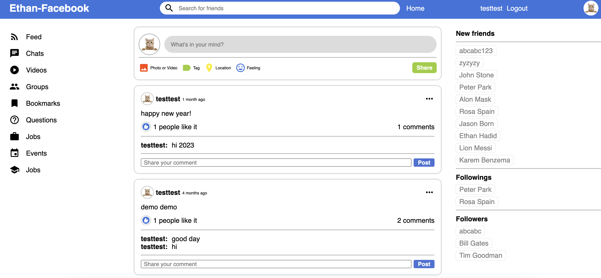

## Introduction

This application clone Facebook.com. You can register or just login as a guest. On this website, you can post your thoughts, like other's post, make a comment, follow others, and see other people's information. 

## Screenshot



## Try it online

```
https://ethan-book-client.onrender.com/home
```

## Download and Installation
1. Clone this repository
2. Install dependencies using `npm install`
3. Configure Firebase by following the instructions in the Firebase documentation
4. Start the app using `npm start`

## Functions

* Register, log in, or user guest account
* Follow others, or followed by others
* Search for friends
* Post your thoughts and comments
* Like a post
* See other user's information